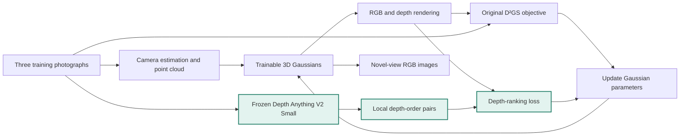
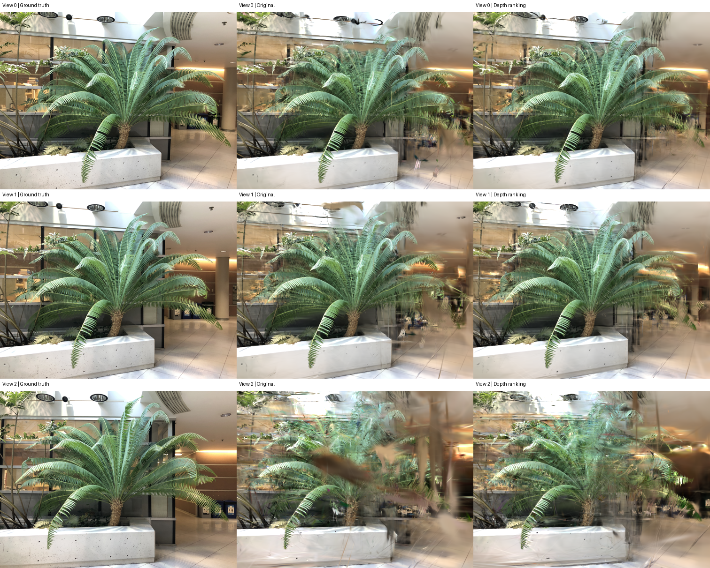
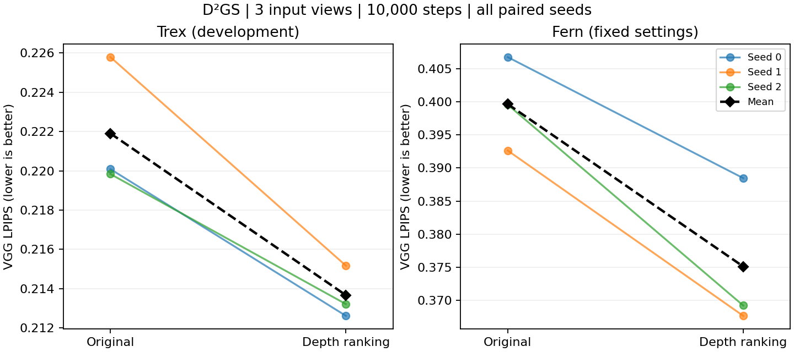

# Depth-guided sparse-view Gaussian reconstruction

An ongoing research project on **D²GS with local depth-ranking supervision**. The aim is to understand and reduce novel-view ghosting when reconstructing a scene from three photographs.

The current implementation improves LPIPS on two LLFF scenes under paired, three-seed comparisons. It still produces substantial ghosting in difficult views. This is static scene reconstruction and novel-view rendering, not an action-conditioned video world model.

## At a glance

[Visual comparisons](docs/VISUAL_RESULTS.md) · [Reproduce the experiment](docs/REPRODUCING.md) · [Experiment results](results/fern_validation/report.md) · [Code map](docs/CODE_MAP.md)



Green nodes show the added supervision branch. The teacher is frozen; gradients from the ranking loss update the Gaussian scene. Held-out images are used only for evaluation.

## Visual preview

**Fern · seed 0 · all three held-out views.** Columns: ground truth, reproduced D²GS, and depth ranking. The complete views include the difficult third view; this is not a selection of favourable crops.



The measured gain is modest and ghosting remains visible. [Open the visual gallery](docs/VISUAL_RESULTS.md) for the trex comparison and paired-seed chart.

## Results

Each method uses three input views and 10,000 training steps per seed. Lower standard VGG LPIPS is better.

| Scene | Reproduced D²GS | + depth ranking | Relative reduction | Paired seed wins |
|---|---:|---:|---:|---:|
| trex — development | 0.221905 | 0.213664 | 3.71% | 3/3 |
| fern — fixed-setting validation | 0.399664 | 0.375101 | 6.15% | 3/3 |

On fern, mean PSNR improves from 17.817 to 18.398 and SSIM from 0.5322 to 0.5491. Training takes about 236 seconds per run instead of 142 seconds on the recorded GPU. These numbers compare against our adapted reproduction, not the authors' published benchmark table.



[Full fern report](results/fern_validation/report.md) · [Trex comparison](results/trex_ranking/report.md) · [Machine-readable results](results/fern_validation/metrics.json)

## Method

A frozen Depth Anything V2 Small model supplies local front-to-back relationships in the training images. An additional differentiable Gaussian depth render is used to penalise violations of these relationships. This follows the local depth-ranking idea in [SparseNeRF](https://sparsenerf.github.io/); it is an adaptation to D²GS, not a claim to have invented depth ranking or reproduced all of SparseNeRF.

The ranking loss uses a margin of 0.05, up to 4,096 pixel pairs per step, and a weight that rises to 0.01 between steps 1,000 and 3,000. It adds no new trainable network. The original RGB training branch and a switch to disable ranking are preserved.

Core implementation: [`methods/rank_supervision.py`](methods/rank_supervision.py), [`scripts/setup/prepare_rank_source.py`](scripts/setup/prepare_rank_source.py), and [`scripts/train/run_fern_comparison.py`](scripts/train/run_fern_comparison.py).

## What did not work

Negative results are retained, rather than folded into the final method:

- **Spatially coordinated dropout:** reduced variation in local point retention, but worsened trex LPIPS by 2.23% across all three seeds. [Report](results/trex_dropout/report.md)
- **Augmentation-consistent pair selection:** did not consistently outperform ordinary depth ranking; one win and two losses across three seeds. [Report](results/trex_ranking/report.md)
- **Camera-depth and density-cache corrections:** implementation checks passed, but did not establish a reliable quality gain. [Report](results/trex_corrections/report.md)
- **Room preprocessing:** default three-view dense fusion produced only 14 points; one documented fusion adjustment produced 55. Training was not launched on room. Fern was selected after this preprocessing failure, before evaluating its quality. [Details](results/fern_validation/report.md)

A fixed inference opacity multiplier of 0.85 is also retained as a simple control. It is reported separately from the ranking improvement. [Diagnostics](results/trex_diagnostics/report.md)

## Source and reproduction

Upstream D²GS is pinned to `9adb7355092e8bd2b302e16b194c693fa51004d8`. The repository contains our experiment code and a patch against that revision, rather than a second copy of the upstream repository. See [third-party attribution](THIRD_PARTY.md) and [the reproduction guide](docs/REPRODUCING.md).

```bash
python3 scripts/setup/bootstrap_sources.py
```

This fetches upstream source, applies the recorded controls and CUDA compatibility patch, and verifies the resulting file hashes. It does **not** install dependencies, download datasets or start GPU work. The clean-source reconstruction was checked locally against the experiment snapshots; a new end-to-end training reproduction has not been run as part of packaging this repository.

The recorded experiments used Linux, Python 3.12, PyTorch 2.8, CUDA 12.8 and PyCOLMAP 4.2. Author-provided far-field masks were unavailable, so masks were reconstructed with frozen DAV2 Small. This and the environment differences prevent a claim of exact official reproduction.

## Repository layout

```text
methods/             Depth-ranking loss and opacity control
scripts/
  setup/             Recover pinned source and integrate the method
  data/              Scene preparation, masks and depth priors
  train/             Bounded baseline and comparison runners
  evaluate/          Image metrics and camera-path rendering
  analysis/          Failure analysis, reports and plots
  checks/            Mechanism and integration checks
  archive/           Historical experiment packaging helpers
docs/                Reproduction guide, protocols and visual gallery
patches/             Upstream patch and source/checkpoint identities
results/             Curated metrics, reports and figures
```

See [the code map](docs/CODE_MAP.md) for the main entry points. Run commands from the repository root; generated data and runs continue to live there. Historical reports retain original filenames; [the path mapping](docs/script_locations.json) locates each moved script.

Datasets, model weights, full run directories, local source checkouts, videos and archive backups are not committed. Published report copies normalise machine paths and identifiers; numerical results are unchanged. [`results/provenance.json`](results/provenance.json) records the original artifact hashes. Historical report filenames referring to large local backups are not downloadable Git artifacts.

## Scope

This is a two-scene study, with trex used for development and fern evaluated using fixed settings. It is not a complete LLFF benchmark or proof of generalisation to arbitrary scenes. The most difficult fern view still contains severe ghosting. Further work should explain these residual failures before adding another constraint.
