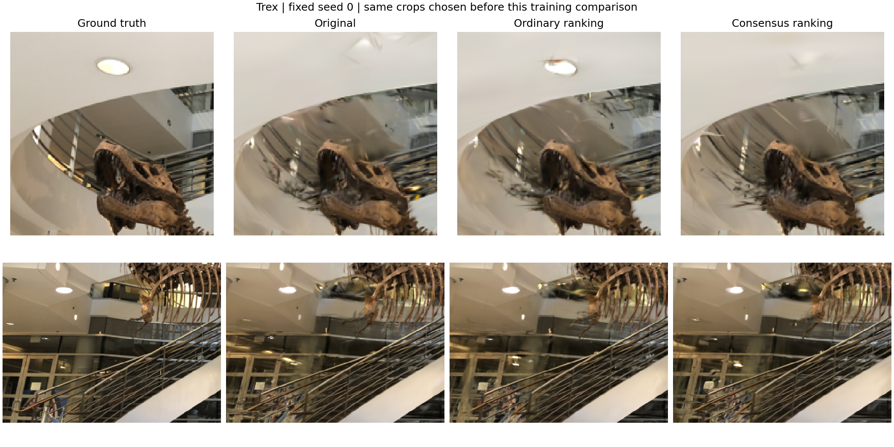

# Visual results

These are recorded experiment outputs, not illustrations of an expected result. Both scenes use three training views, 10,000 steps and paired seeds 0–2. The images below show seed 0; quantitative results include every seed.

## Fern: complete held-out views

Columns: ground truth, reproduced D²GS, depth ranking. Rows: all three held-out cameras. No opacity adjustment is used here. The third view remains severely degraded despite the metric improvement.

[Metrics and protocol limitations](../results/fern_validation/report.md)

## Trex: local comparison

This diagnostic figure shows local image regions for baseline, ordinary ranking and consensus ranking. Crops illustrate differences; they do not establish whole-scene quality. Refer to the report for the complete evaluation.

[Full trex comparison](../results/trex_ranking/report.md)

## Every paired seed

Each coloured line connects the same seed before and after adding depth ranking. The black line shows the mean. Lower VGG LPIPS is better; this is an image-perceptual metric, not a direct measurement of 3D geometry.

The mean LPIPS reductions are 3.71% on trex and 6.15% on fern. These two scenes do not establish generalisation to the full LLFF dataset. Training is approximately 1.66 times as long on fern with ranking enabled.
